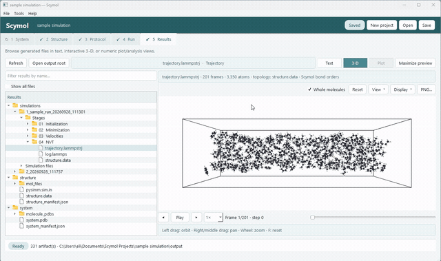
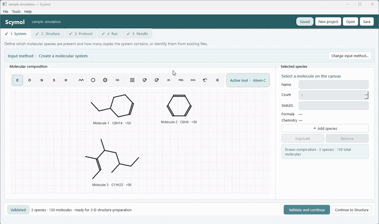
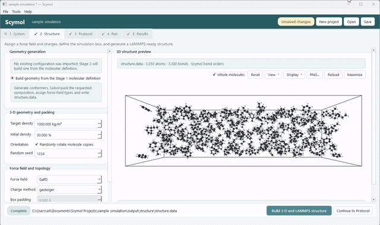
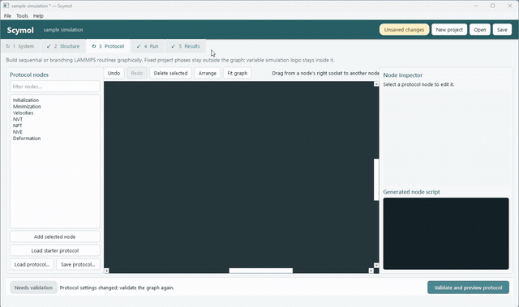
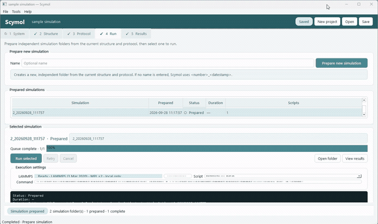

# Scymol

**Build molecular systems, design LAMMPS protocols, run simulations, and inspect the results in one graphical workspace.**

[](https://www.python.org/)
[](https://doc.qt.io/qtforpython-6/)
[](https://www.lammps.org/)
[](pyproject.toml)
[](LICENSE)

<p align="center">
  
</p>

*Scymol keeps system construction, protocol design, execution, plotting, and trajectory inspection in one project. Animated workflow previews are shown below.*

Scymol is a desktop workbench for preparing and running molecular simulations with [LAMMPS](https://www.lammps.org/). It keeps the molecular definition, generated structure, simulation protocol, execution history, and results together in a portable project directory.

Scymol 2.0 is the next generation of the original [Scymol](https://github.com/eli-ams/scymol). It preserves Scymol's goal of making molecular simulation accessible without hiding the generated inputs or limiting advanced users to a rigid workflow. The new application adds project-based state, direct system import, visual protocol graphs, integrated 3D inspection, and a clearer foundation for reproducible and high-throughput workflows.

```text
Define or import  →  Build or reuse  →  Design protocol  →  Prepare and run  →  Inspect
     System             Structure           Protocol             Run             Results
```

## Highlights

- Draw molecular species in the built-in 2D editor or enter their SMILES representations.
- Construct multi-species systems with explicit molecule counts and reproducible packing settings.
- Import an existing LAMMPS data file, dump trajectory, or both.
- Preserve compatible imported coordinates, topology, atom types, charges, and coefficients.
- Generate 3D conformers and pack mixtures using deterministic Sobol sampling and clash rejection.
- Assign force-field parameters and charges through [PySIMM](https://pysimm.org/).
- Build simulation protocols as validated, branching graphs.
- Generate a separate LAMMPS input script for every root-to-leaf protocol path.
- Run LAMMPS from the interface, follow live output, cancel a process, or retry a failed run.
- Explore structures, trajectories, logs, numeric tables, statistics, and plots without leaving the project.
- Track generated artifacts with manifests and signatures that identify stale results after settings change.

## Workflow

### 1. Define the molecular system

Start from molecular identities or from existing simulation files.

In **Build** mode, draw or enter each molecular species, assign a name and copy count, and validate the definition before generating expensive artifacts. The editor supports atoms, bonds, chains, rings, cleanup, undo/redo, and image export.

<p align="center">
  
</p>

In **Import** mode, provide a LAMMPS data file, a dump trajectory, or both:

- A data file supplies coordinates, topology, atom types, and—when present—force-field coefficients.
- A trajectory replaces the starting coordinates with its last frame while retaining topology from the data file.
- A trajectory without a data file can be converted into a reusable last-frame structure. Scymol infers its connectivity, which remains an approximation that must be reviewed carefully. Trajectories do not contain force-field coefficients, so direct reuse requires compatible coefficients elsewhere in the LAMMPS input.

### 2. Build or reuse the structure

For a newly defined system, Scymol generates molecular conformers, estimates a box from the target density, places copies using a seeded Sobol sequence, rejects steric clashes, and optionally applies random rotations. PySIMM then assigns the selected force field and charge model and writes a LAMMPS-compatible `structure.data` file.

Available force-field choices currently include GAFF2, GAFF, Dreiding, and PCFF. Force-field coverage depends on the chemistry being modeled; generation success does not by itself establish scientific suitability.

When an imported LAMMPS data file already contains complete and compatible topology and coefficients, Scymol can reuse it directly instead of regenerating the system.

<p align="center">
  
</p>

### 3. Design the simulation protocol

The Protocol editor represents the simulation as a directed acyclic graph. Available node families include:

- Initialization
- Energy minimization
- Velocity creation
- NVT dynamics
- NPT dynamics
- NVE dynamics
- Deformation

Each node has typed parameters, immediate validation, and a preview of the LAMMPS commands it contributes. Branches are explicit: every root-to-leaf path is compiled into its own `protocol_*.in` file, making alternatives easier to inspect, reproduce, and extend into higher-throughput studies.

<p align="center">
  
</p>

### 4. Prepare and run LAMMPS

The Run stage copies the selected structure into the simulation directory, generates the protocol scripts and manifest, and launches the chosen script with a configurable command. The default is:

```text
lmp -in "{script}"
```

The command accepts `{script}`, `{script_path}`, and `{output_dir}` placeholders, so local, MPI, and cluster-launch commands can be adapted to the environment. Standard output and errors are displayed live. Runs can be cancelled, inspected, and retried.

<p align="center">
  
</p>

### 5. Explore the results

The Results stage discovers artifacts within the project and selects an appropriate viewer:

- LAMMPS structures and dump trajectories open in the integrated 3D viewer.
- `log.lammps` thermodynamic output and other numeric files open as tables and plots.
- Text files and generated scripts open in a text viewer.
- Numeric columns can be summarized with descriptive statistics and plotted as line or scatter series.

<p align="center">
  
</p>

The 3D viewer supports orthogonal and triclinic cells, trajectory playback, camera controls, periodic-boundary reconstruction, and large molecular scenes rendered with ModernGL.

## Installation

### Requirements

- Python 3.10 or newer.
- An OpenGL-capable system for the integrated 3D viewer.
- [PySIMM](https://pysimm.org/) for generating and parameterizing new structures.
- [LAMMPS](https://docs.lammps.org/Install.html) to execute simulations.

LAMMPS and PySIMM are not required merely to edit protocols or inspect compatible existing results. The recommended Conda installation supplies Scymol, PySIMM, a tested LAMMPS release, and OpenMPI on supported Linux systems. A pip installation supplies the Python application and its Python dependencies, but not operating-system LAMMPS or MPI executables. Some GAFF-family systems require a LAMMPS build with the `EXTRA-MOLECULE` package, including support for `dihedral_style fourier`; see [`lammps.txt`](lammps.txt).

### Install with Conda (recommended)

Create an isolated environment and install Scymol 2.0.0 from the `eli.ams` channel, with the remaining dependencies supplied by `conda-forge`:

```bash
conda create -n scymol \
  --override-channels \
  -c eli.ams \
  -c conda-forge \
  scymol=2.0.0
conda activate scymol
scymol
```

`--override-channels` prevents packages from unrelated configured channels from being mixed into the environment. This installation includes PySIMM 1.1 from the `eli.ams` channel and a compatible Conda LAMMPS/OpenMPI stack. The published package constrains LAMMPS to the tested range `>=2024.08.29,<2025.07.22`; newer LAMMPS releases can still be configured manually from **Tools → LAMMPS execution setup**.

To verify the Conda-provided LAMMPS executable independently:

```bash
lmp -help
```

### Install with pip

Install PySIMM 1.1 from its upstream GitHub release, then install Scymol from PyPI into an activated Python 3.10 or newer virtual environment:

```bash
python -m pip install --upgrade pip
python -m pip install "pysimm @ git+https://github.com/polysimtools/pysimm.git@1.1"
python -m pip install scymol
scymol
```

After installation, Scymol can discover compatible executables already available on the system. The selected LAMMPS and MPI configuration can be inspected, tested, and changed from the application.

### Optional Windows LAMMPS/MPI bundle

This is only a convenience for 64-bit Windows users who do not already have LAMMPS and MPI and prefer not to install or compile them separately. The repository includes the optional [`lammps+mpi_win64.zip`](distributables/lammps+mpi_win64.zip) bundle reused from Scymol 1.0. Download it and extract the entire archive so that the executables and their accompanying DLL files remain together. Then open **Tools → LAMMPS execution setup** in Scymol, select the extracted `LAMMPS.exe` and `mpiexec.exe`, choose the number of MPI processes, and click **Test and save**. Scymol runs a short packaged smoke test before accepting the configuration.

The bundle is provided for convenience; an existing compatible LAMMPS/MPI installation can always be used instead.

### Install from source

For development, clone the repository and create an isolated environment from the repository directory:

```bash
conda create -n scymol python=3.12
conda activate scymol
```

Install PySIMM 1.1 from its upstream GitHub release and Scymol in editable mode:

```bash
python -m pip install "pysimm @ git+https://github.com/polysimtools/pysimm.git@1.1"
python -m pip install -e .
```

Launch the application with either command:

```bash
scymol
```

```bash
python run_gui.py
```

If LAMMPS is already installed, confirm that `lmp` is available on `PATH`, or replace the Run-tab command with the appropriate executable. For example:

```text
mpiexec -n 8 lmp -in "{script}"
```

## Quick start

1. Launch Scymol and choose **Create a molecular system**.
2. Draw or enter one or more molecules, choose their copy counts, and validate the system.
3. Select the target density, packing settings, force field, and charge method, then build the structure.
4. Review `structure.data` in the integrated 3D viewer.
5. Create or modify the protocol graph and validate it.
6. Select **Prepare simulation** to generate the LAMMPS scripts.
7. Confirm the execution command and run the desired protocol path.
8. Open the Results tab to inspect trajectories, logs, tables, and plots.

For a guided example, select the **50-benzene tutorial** on startup or choose **Help → Guided tutorial**.

## Project format

Scymol writes all editable state and generated artifacts into the project directory selected by the user. It does not silently create a shared global workspace.

```text
my-project/
├── scymol.json
└── output/
    ├── system/
    │   ├── system.pdb
    │   ├── system_manifest.json
    │   ├── molecule_pdbs/
    │   └── imported/
    ├── structure/
    │   ├── structure.data
    │   ├── structure_manifest.json
    │   └── mol_files/
    └── simulation/
        ├── structure.data
        ├── run_manifest.json
        └── protocol_*.in
```

The `scymol.json` file stores the editable project. Manifests record the settings and source artifacts used to produce generated files. Stable signatures allow Scymol to warn when a molecular definition or structure setting has changed and downstream artifacts need to be rebuilt.

## Scientific scope

Scymol helps construct, execute, and audit a molecular-simulation workflow. It does not determine whether a force field, charge model, ensemble, time step, simulation duration, or observable is appropriate for a particular scientific question.

Always review the generated structure and LAMMPS scripts before production use. Validate the model and protocol against suitable experimental data, literature, or trusted reference calculations.

Scymol is under active development. Imported-file compatibility depends on the information present in the source files, and optional scientific backends may impose their own platform and chemistry limitations.

## Development

The source tree separates the project model and scientific workflow from the Qt interface:

```text
repository/
├── distributables/          # optional precompiled Windows LAMMPS/MPI bundle
├── src/
│   └── scymol/
│       ├── gui/              # PySide6 interface, editors, plots, and 3D viewer
│       ├── resources/        # packaged LAMMPS smoke-test inputs
│       ├── analysis.py       # numeric and LAMMPS-output parsing
│       ├── chemistry.py      # validation, conformers, packing, and parameterization
│       ├── lammps.py         # LAMMPS command generation
│       ├── models.py         # serializable project model
│       ├── protocol.py       # graph validation and path generation
│       ├── run_generation.py # run artifacts and manifests
│       └── system_import.py  # LAMMPS data and trajectory import
├── markdown_resources/       # screenshots and demonstration videos
├── tests/
├── pyproject.toml
└── run_gui.py
```

Run the test suite from the repository root:

```bash
python -m unittest discover -s tests -v
```

Install the project in editable mode first, as shown above, so the `src`-layout package is importable during test discovery. Tests that require optional graphical or chemistry components may be skipped when those dependencies are unavailable.

## Contributing

Bug reports and focused feature proposals are welcome through the [GitHub issue tracker](https://github.com/eli-ams/scymol/issues). When reporting a problem, include the operating system, Python version, Scymol version, the steps needed to reproduce it, and any relevant terminal or LAMMPS output. Contributions should preserve the inspectable project format and generated LAMMPS inputs.

## Citation

If Scymol supports your research, please cite:

> Assaf, E. I., Maalouf, E., Liu, X., Lin, P., & Erkens, S. (2025). Scymol: A python-based software package for initializing and running molecular dynamics simulations using LAMMPS. *SoftwareX, 29*, 102044. [https://doi.org/10.1016/j.softx.2025.102044](https://doi.org/10.1016/j.softx.2025.102044)

```bibtex
@article{Assaf2025Scymol,
  author  = {Assaf, Eli I. and Maalouf, Elsa and Liu, Xueyan and Lin, Peng and Erkens, Sandra},
  title   = {Scymol: A python-based software package for initializing and running molecular dynamics simulations using LAMMPS},
  journal = {SoftwareX},
  volume  = {29},
  pages   = {102044},
  year    = {2025},
  doi     = {10.1016/j.softx.2025.102044}
}
```

## License

Scymol is distributed under the [GNU General Public License v3.0](https://www.gnu.org/licenses/gpl-3.0.html). See the repository's `LICENSE` file for the full terms.

## Acknowledgements

Scymol was created by Eli I. Assaf, Elsa Maalouf, Xueyan Liu, Peng Lin, and Sandra Erkens. This release continues the original project's aim of making reproducible molecular-simulation workflows accessible without concealing their underlying LAMMPS inputs.
